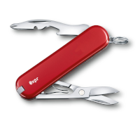

# swiss-knife

[](https://github.com/ziv/swiss-knife/actions/workflows/main.yml)
[](https://github.com/ziv/swiss-knife/actions/workflows/codeql-analysis.yml)

My utilities collection.



```shell
npm i @xpr/swiss-knife
```

* fp
    * [compose](src/fp/compose.md)
    * [pipe](src/fp/pipe.md)
* http
    * [https](src/http/https.md)
* streams
    * [from-string](src/streams/from-string.md)
    * [to-promise](src/streams/from-string.md)
* strings
    * [trim-left](src/strings/trim-left.ts)
    * [trim-right](src/strings/trim-right.ts)
